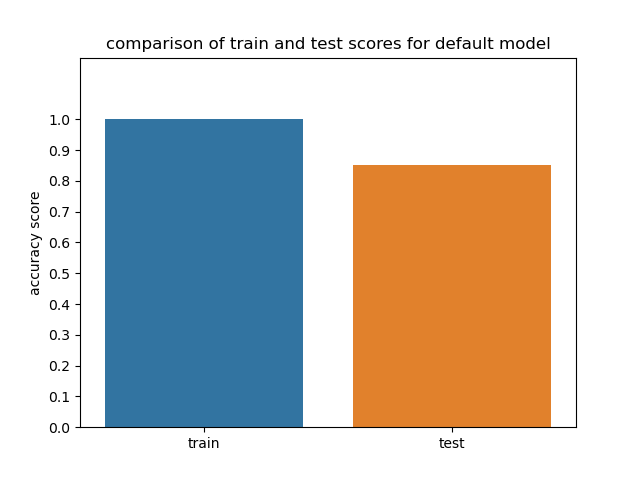
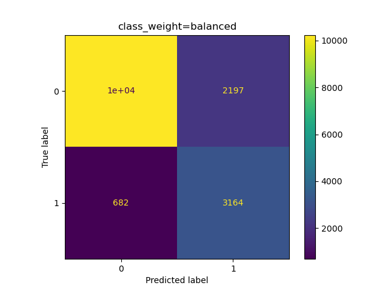

# Evaluation challenge: us-income

## Description
  This was an assignment we received during our training at BeCode.  
  We started from an already cleaning dataset about predicting the income of us-citizens based on 
  14 features. Our goal was to use the model to make correct predictions, using RandomForestClassifier.
  The focus of this project is model evaluation, more than model choice or preprocessing. 

  This will be your baseline accuracy against which you'll measure your improvements.

  Then you can get more complicated and use multiple evaluation metrics, see if there is a hint of overfitting, 
  tune your hyper-parameters to have a better score, etc...

## Installation
### Python version
* Python 3.9

### Databases
https://github.com/becodeorg/GNT-Arai-2.31/tree/master/content/additional_resources/datasets/US%20Income

### Packages used
* pandas
* numpy
* matplotlib.pyplot
* seaborn
* sklearn

## Project process
### determine base accuracy
First step of the project is to run a default Random Forest classifier over the train set and predict
the test set. In the rest of the project I will try to better this score.

Comparing the scores on the test and training set, the model is clearly overfitting.

| Classifier model  | Accuracy score      | Set type | Random state |
|------------------------|:----------------:|:-----:|:--------------:|
| RandomForrestClassifier | 0,99  | train | 42 | 
| RandomForestClassifier | 0,85 | test  | 42 |

Looking at the confusion matrix, I want the predictions class 1 (income higher than 50k) 
to be a lot better. 

### first improvement: cross-validation

Cross-validation on the train set leads to a lower accuracy score, much closer to 
the accuracy score on the test set. I will use cross-validation
to train and fit the model in the next steps. 

|cross validation score | number of folds  | standard deviation |
|:-----------------------:|:--------------:|:----------------:|
|   0.86              |        10        |     +/- 0.50       |

## tuning hyperparameters
### random grid search

I first ran a randomized grid search to get an indication of the parameter space that leads 
to the best results. 

| used features | values | 
|---------------|--------|
| n_estimators | [10-2011] with steps of 250 | 
| max_features | 'auto', 'sqrt', 'log2' | 
| max_depth | None, 10, 50, 100, 200, 500 | 
| class-weight | None, 'balanced', 'balanced_subsample' | 
| bootstrap | True, False | 

These were the resulting best hyperparameter values: 
|features| best values|
|--------|------------|
| n_estimators | 1010 |
| max_features| log2 |
| max_depth | 10 | 
| class-weight | None| 
| bootstrap | False | 

### grid search
Based on the results of the randomised grid search, I ran a thorough grid search using the
following parameter spaces. As a metric I used 'accuracy': 

| used features | values | 
|:---------------:|:--------:|
| n_estimators | [950-1030] with steps of 10 | 
| max_features | 'log2' | 
| max_depth | [6, 21] with steps of 2 | 
| bootstrap | False | 

The resulting best values were these: 

|features| best values|
|:--------:|:------------:|
| n_estimators | 950 |
| max_depth | 20 | 

### evaluating the best model after grid search 
To fit the best model resulting from the grid search I hypertuned 
the parameters like this: 

| used features | values | 
|:---------------:|:--------:|
| n_estimators | 950 | 
| max_features | 'log2' | 
| max_depth | 20 | 
| bootstrap | False | 
|min_samples_leaf| 5 |

| set type | accuracy score |
|:--------:|:-----:|
| train | 0.901 |
| cross-validated | 0.865 | 
| test | 0.859 |

11719   716
1579    2267

Matthews corrcoef: 0.585
roc auc score: .766

The confusion matrix shows that the model is not really better
at classifying true positives. I thought it possible that this 
was related to the imbalance between negative and positive samples.

So I went looking for balanced-related hyperparameters to tune. 

### playing with the class_weight parameter
I altered the class_weight parameter, along with the best model values resulting from 
the grid search. 

class_weight | set type | accuracy score | roc | matthew coefficient
|:-----:|:--------:|:-----:|:---:|:-----:|
|None | train | 0.902 | 0.766 | 0.585 |
| None | test | 0.860 | 0.766 | 0.585 |
| balanced| test | 0.876 | 0.823 | 0.583 |
| balanced | test | 0.823 | 0.823 | 0.583 | 

## Contributors
| Name                  | Github                                 |
|-----------------------|----------------------------------------|
| Maarten Van den Bulcke           | https://github.com/MaartenVdBulcke       |

## Timeline
13/08/2021 - 16/08/2021
