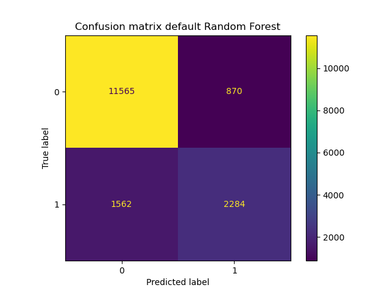

# Evaluation challenge: us-income

## Description
  This was an assignment we received during our training at BeCode.  
  We started from an already cleaning dataset about predicting the income of us-citizens based on 
  14 features. Our goal was to use the model to make correct predictions, using RandomForestClassifier.
  The focus of this project is model evaluation, more than model choice or preprocessing. 

  This will be your baseline accuracy against which you'll measure your improvements.

  Then you can get more complicated and use multiple evaluation metrics, see if there is a hint of overfitting, 
  tune your hyper-parameters to have a better score, etc...

## Installation
### Python version
* Python 3.9

### Databases
https://github.com/becodeorg/GNT-Arai-2.31/tree/master/content/additional_resources/datasets/US%20Income

### Packages used
* pandas
* numpy
* matplotlib.pyplot
* seaborn
* sklearn

[comment]: <> (## Usage)

[comment]: <> (| File                        | Description                                                     |)

[comment]: <> (|-----------------------------|-----------------------------------------------------------------|)

[comment]: <> (| main.py                   | File containing Python code.     Used for cleaning and feature engineering the data |)

[comment]: <> (| plots.py                    | File containing Python code.    Used for making some explanatory plots for this README. |)

[comment]: <> (| utils/model.py              | File containing Python code, using ML - Random Forest.    Fitting our data to the model and use to it make predictions. |)

[comment]: <> (| utils/manipulate_dataset.py | File containing Python code. Functions made for ease of use in a team enviroment. |)

[comment]: <> (| utils/plotting.py           | File containing Python code. Used for getting to know the data. Made plots to find correlations between features. |)

[comment]: <> (| csv_output                  | Folder containing some of the csv-files we used for our coding. Not all of our outputted files are in here,    since Github has a file limit of 100MB. |)

[comment]: <> (| visuals                     | Folder containing plots we deemed interesting and helped us gain    insights on the data. |)

## Project process
### determine base accuracy
First step of the project is to run a default Random Forest classifier over the train set and predict
the test set. In the rest of the project I will try to better this score.  
| Classifier model  | Base accuracy score      |                                                                                         |
|------------------------|---------------------|
| RandomForestClassifier | 0,8504391622136233 | 

Looking at the confusion matrix, it is clear that the prediction of class 1 (income higher than 50k) can 
still do a lot better: 

[comment]: <> (![]&#40;visuals/Exp_24_RPM_reading_error.png&#41;)

[comment]: <> (| Column name of feature | Change made                             | Reason                                                                                                                        |)

[comment]: <> (|------------------------|-----------------------------------------|-------------------------------------------------------------------------------------------------------------------------------|)

[comment]: <> (| timestamp              | Only keeping rows equal to or below 1,5 | We found that the biggest differences between it being a bad or good bearing,  could be found in the first parts of the test.   With the use of plotting, we discovered a cut off point. |)

[comment]: <> (![]&#40;visuals/beginning_vibrations_x_exp_nr_98.png&#41;)

[comment]: <> (![]&#40;visuals/strip_vibrations_x_exp_nr_107.png&#41;)

[comment]: <> (![]&#40;visuals/strip_vibrations_x_exp_nr_2.png&#41;)

[comment]: <> (| Column names of feature | Changes made                                                            | Reason                                                                                                      |)

[comment]: <> (|-------------------------|-------------------------------------------------------------------------|-------------------------------------------------------------------------------------------------------------|)

[comment]: <> (| a1_x   a1_y   a1_z   a2_x   a2_y   a2_z | For every "experiment_id", took the mean of every column mentioned.  For every row, changed the value in every column mentioned to its mean. | The model had an easier time of fitting and was still able to make accurate predictions with these changes. |)

[comment]: <> (## Visuals)

[comment]: <> (### Machine used to gather the data on bearings)

[comment]: <> (![]&#40;visuals/bearing_test_machine.jpg&#41;)

[comment]: <> (### Plot showing the min-max-difference of every axis, on every bearing.)

[comment]: <> (![]&#40;visuals/vibration_spread_differences_on_all_axes.png&#41;)

[comment]: <> (### Plot that gave us the idea to look into the first seconds.)

[comment]: <> (![]&#40;visuals/control_vs_good_vs_bad_Y_Speed_Hz.png&#41;)

[comment]: <> (### Plot that showed possible clusters)

[comment]: <> (Ready for future exploration)

[comment]: <> (![]&#40;visuals/scatter_cluster_ready.png&#41;)

## Contributors
| Name                  | Github                                 |
|-----------------------|----------------------------------------|
| Maarten Van den Bulcke           | https://github.com/MaartenVdBulcke       |

## Timeline
13/08/2021 - 16/08/2021
